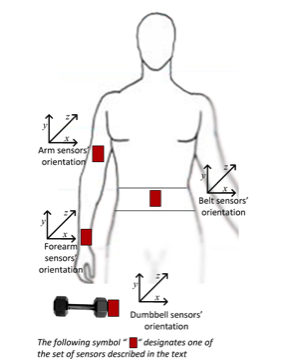

Modeling Good Form
-------

### Introduction

One of the great advances of the 20th and 21st century has been the exponential shrinking of circuitry and computing power.  What once required at least one floor an an entire building (a punch-card computer of yesteryear), now looks absolutely archaic compared to the (relative) supercomputers we carry around in our pockets all day every day.  The applications of tehcnology that can fit on our bodies is limited only by one's imagination. There are sceintists out there using tiny microchips and sensors to predict illness, fight disease, point you in the direction of the best food-truck, and even help you find the love of your life. All from a tiny pieces of silicone and metal. What a world we live in.  

One rapidly booming area of sensor technology is movement tracking. One of the foreruners in this world, Fitbit, just had an IPO on Wall Street last week that raised them $6 billion dollars.  In addition to Fitbit, the two tech titans Apple and Google are throwing themselves headfirst into wearable tech, there are dozens of "smart watches" out there running Android OS and Apple just recently released their first "Apple Watch" to equal parts fanfare ("APPLE HAS CHANGED THE WORLD!!") and scruitiny ("Google did it already, not impressive!").  In addition to these three elephants in the room, there are numerous other players, names like Nike, Garmin and Jawbone all have skin in the movement tracking game. Additionally, the most funded Kickstarter campaign to date has been the Pebble Time, another player in the movement tracking/smartwatch arena.

With that kind of capital and branding on the line, clearly this is an area ripe for discussion, analysis and research.  When looking around at the world of wearables, one thing is obvious, everyone is focusing on WHAT activity you are doing. "One more thing...the Apple Watch can tell whether you are running, walking, or going down stairs on your hands! All without any additional info from you!" There seems to be a huge lack of attention on *how well* you are doing the activity, i.e. your form. As anyone who is familiar with exercise will tell you, if you are using bad form, you may as well not be exercising (because you are probably going to hurt yourself). For this reason, I wanted to see the practicality of building a machine learning algorithm that has the ability to identify not just your activity, but how well you are doing that activity. 

Lucky for us, some folks from the Lancaster University School of Engineering in the United Kingdom were curious about the same thing and had the research grants to get the data.  The researchers attached accelererometers to a light dumbbell as well as the subject's waist, forearm, and arm.  They proceeded to have the subjects to a basic dumbbell arm curl in 5 distinct ways, once with perfect form and four times with common form errors. The acceleremoters on the person took a wide range of measurements in multiple planes of direction during the exercise.  All of this data was recorded in a database along with the "Classe" of the exercise, Classe A corresponds to perfect form while Class B-E all are representative of the various common errors in form.

 

### Preprocessing

By looking at the data in a spreadsheet viewer of choice (mine is Excel) I can see there are a lot of columns that are not going to be useful. I see lots of blanks, "NA"s, and "#Div/0"s, so I am going to set those as my NA values for when I read the file .CSV file into R. Once I read the data in, I am going to count how many NAs are in each column, then take the names of each column with less than 10,000 NAs. When I looked at my list of NA counts by column, I noticed they were all either 0 or in the 19,000 range. So it seems to be all or nothing with regards to these columns. I next subsetted my original data with just the "good variables" (i.e. those without NAs), and took out the first 7 columns as they were all metadata related. We want to build our predictions using only sensor data.


```r
library(caret)
library(dplyr)
set.seed(311)
NAs <- c("", "#DIV/0!", "NA")                            # Three symbols to read in as NAs
pml <- read.csv("pml-training.csv", na.strings = NAs)    
fin <- apply(apply(pml, 2, is.na), 2, sum)               # Count number of NAs in each column
good.vars.names <- names(fin[fin<10000])                 # Make a vector of good column names, used to subet

pml.df <- tbl_df(pml)
pml.pruned <- select(pml.df, one_of(good.vars.names)) %>% select(-(1:7))
```

Now that we have gotten down to the variables of interest, we partition our data into training and test sets. We are going to use the Random Forest algorithm because it is one of the best classifier algos around.  One of the downsides of Random Forests are their tendancy towards overfitting. To avoid this, we are going to use 10-fold cross-validation repeated 10 times. Essentially this means R will take different subsets of the training data, build models, validate them against the other piece of the training data and average it all together to get our final model. Just a warning, repeated cross-validation can GREATLY increase the amount of time it takes your model to run. I set up the cross-validadtion below in the `trainControl` function, which will be passed to our model building code next.


```r
train.index <- createDataPartition(y = pml.pruned$classe, p = 0.7, list = FALSE)
pml.train <- pml.pruned[train.index,]
pml.test <- pml.pruned[-train.index,]
fitControl <- trainControl(
     method = "repeatedcv",
     number = 10,
     repeats = 10)
```


### Model

R has a package called `caret` which acts as unified interface for the many machine learning methods that exist. The below line of code tells R to build a prediction model of the classe variable against all other variables in the `pml.test` dataset. The modifiers we added will tell it to use the cross-validation we set up above, use the Random Forest method, and use Principal Component Analysis (PCA) as a preprocessing technique. Principal Component Analysis is a preprocessing technique that will identify the most important predictors, and only use those. In our case, the final Random Forest actually only used 25 of the 52 variables we passed to `caret` thanks to PCA.

Be warned, the below line of code took overnight to run on my 2015 Macbook Air. For faster processing, a computer with faster (or multiple) processors or cloud computing could be utilized.


```r
pml.rf.mod <- train(classe ~ ., data = pml.test, method = 'rf', trControl = fitControl, preProcess = "PCA")
```

### Checking Prediction Accuracy

Let's take a look at our final model using the below code including a confusion matrix based on the resampling we did.


```r
mod1$finalModel ; confusionMatrix(mod1)
```

```
## 
## Call:
##  randomForest(x = x, y = y, mtry = param$mtry) 
##                Type of random forest: classification
##                      Number of trees: 500
## No. of variables tried at each split: 2
## 
##         OOB estimate of  error rate: 2.33%
## Confusion matrix:
##      A    B    C    D    E class.error
## A 3879    9   11    4    3 0.006912442
## B   45 2565   40    0    8 0.034988713
## C    5   33 2334   21    3 0.025876461
## D    4    1   83 2161    3 0.040408526
## E    1   10   21   15 2478 0.018613861
```

```
## Cross-Validated (10 fold, repeated 10 times) Confusion Matrix 
## 
## (entries are percentages of table totals)
##  
##           Reference
## Prediction    A    B    C    D    E
##          A 28.2  0.3  0.0  0.0  0.0
##          B  0.1 18.7  0.3  0.0  0.1
##          C  0.1  0.3 16.9  0.7  0.2
##          D  0.0  0.0  0.2 15.6  0.1
##          E  0.0  0.0  0.0  0.0 18.0
```

We have an OOB error estimate of 2.33%. Let's now use our model on the test data partition we made earlier and look at the confusion matrix. 


```r
pm.test.preds <- predict(mod1, newdata = pml.test) 
confusionMatrix(pm.test.preds, pml.test$classe)
```

```
## Confusion Matrix and Statistics
## 
##           Reference
## Prediction    A    B    C    D    E
##          A 1665   19    5    3    0
##          B    4 1104   18    0    3
##          C    1   14  996   42    3
##          D    2    1    7  918    7
##          E    2    1    0    1 1069
## 
## Overall Statistics
##                                          
##                Accuracy : 0.9774         
##                  95% CI : (0.9733, 0.981)
##     No Information Rate : 0.2845         
##     P-Value [Acc > NIR] : < 2.2e-16      
##                                          
##                   Kappa : 0.9714         
##  Mcnemar's Test P-Value : 3.096e-07      
## 
## Statistics by Class:
## 
##                      Class: A Class: B Class: C Class: D Class: E
## Sensitivity            0.9946   0.9693   0.9708   0.9523   0.9880
## Specificity            0.9936   0.9947   0.9877   0.9965   0.9992
## Pos Pred Value         0.9840   0.9779   0.9432   0.9818   0.9963
## Neg Pred Value         0.9979   0.9926   0.9938   0.9907   0.9973
## Prevalence             0.2845   0.1935   0.1743   0.1638   0.1839
## Detection Rate         0.2829   0.1876   0.1692   0.1560   0.1816
## Detection Prevalence   0.2875   0.1918   0.1794   0.1589   0.1823
## Balanced Accuracy      0.9941   0.9820   0.9792   0.9744   0.9936
```

So we have an accuracy of 97.76% and an extremely significant P-Value. While there are further methods of pruning our tree and getting more accuracy out of our model, I believe this level of accuracy is sufficient for the purposes of this project.  This was supported by correctly predicting 20/20 of the test cases provided by the professors.
